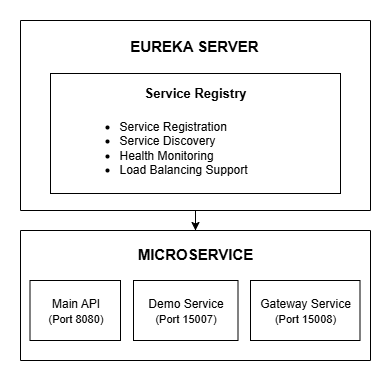

# Bilibili Eureka Service Registry

## 1 - Overview

The **Bilibili Eureka Service Registry** is the central service discovery component of the Bilibili video streaming platform microservices architecture. It enables automatic service registration, discovery, and health monitoring for all microservices in the ecosystem.

## 2 - Purpose

- **Service Discovery**: Automatically register and discover microservices
- **Health Monitoring**: Monitor service health and availability
- **Load Balancing**: Support client-side load balancing
- **Failover**: Handle service failures and recovery

## 3 - Architecture



## 4 - Technology Stack

- **Spring Boot 3.1.6**: Main framework
- **Netflix Eureka Server**: Service discovery and registration
- **Java 17**: Runtime environment
- **Spring Boot Actuator**: Health checks and monitoring
- **Docker**: Containerization support

## 5 - Quick Start

### **Prerequisites**
- Java 17+
- Maven 3.6+
- Docker (optional)

### **Local Development**
```bash
# Clone and build
git clone https://github.com/Billy423/bilibili-eureka.git && \
  cd bilibili-eureka && \
  mvn clean package && \
  mvn spring-boot:run
```

### **Docker Deployment**
```bash
# Build and run
docker build -t bilibili-eureka . && \
  docker run -p 15006:15006 bilibili-eureka
```

### **Using Docker Compose**
```bash
# From the main bilibili project directory
docker compose -f docker-compose.microservices.yml up bilibili-eureka
```

## 6 - Configuration

### **Key Properties**
- **Port**: 15006
- **Service Name**: eureka-server
- **Eureka Config**: Standalone mode, no self-registration
- **Health Checks**: Actuator endpoints enabled

## 7 - Key Features

- **Service Registration**: Automatic service registration on startup
- **Service Discovery**: RESTful API for service discovery
- **Health Monitoring**: Spring Boot Actuator integration
- **High Availability**: Standalone mode with configurable thresholds

## 8 - Monitoring & Health Checks

### **Health Endpoints**
- **Health Check**: `http://localhost:15006/actuator/health`
- **Info**: `http://localhost:15006/actuator/info`
- **Metrics**: `http://localhost:15006/actuator/metrics`

### **Eureka Dashboard**
- **Dashboard**: `http://localhost:15006/`
- **Instances**: View all registered services
- **Health Status**: Monitor service availability

## 9 - Deployment

### **Development Environment**
```bash
# Start Eureka server
mvn spring-boot:run

# Access dashboard
open http://localhost:15006
```

### **Production Environment**
```bash
# Build and run with Docker
docker build -t bilibili-eureka .
docker run -d -p 15006:15006 --name bilibili-eureka bilibili-eureka
```

### **Multi-Service Deployment**
```bash
# Start all microservices
cd /path/to/bilibili
make ms-up

# Check service health
make health-ms
```

## 10 - Development

### **Project Structure**
```
bilibili-eureka/
├── src/main/java/org/example/App.java
├── src/main/resources/application*.properties
├── Dockerfile
└── pom.xml
```

### **Key Classes**
- **`App.java`**: Main Spring Boot application with `@EnableEurekaServer`

## 11 - Related Services

- **[Main API Service](https://github.com/Billy423/bilibili)**: Core business logic
- **[API Gateway](https://github.com/Billy423/bilibili-api-gateway)**: Centralized routing
- **[Demo Service](https://github.com/Billy423/bilibili-microservice)**: Demo endpoints
- **[Frontend](https://github.com/Billy423/bilibili-vue)**: Vue.js interface

---

**This Eureka service registry is the foundation of the Bilibili microservices architecture.**